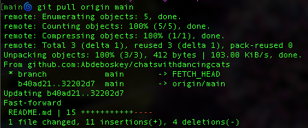
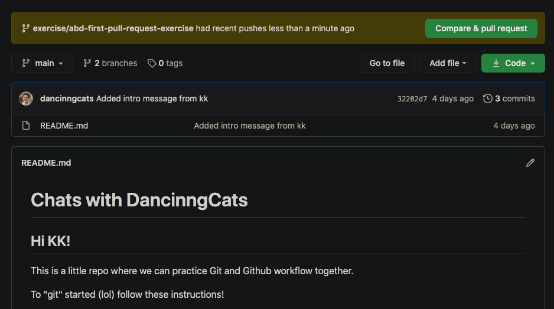

# Chats with DancinngCats

## Hi KK!

This is a little repo where we can practice Git and Github workflow together.

To "git" started (lol) follow these instructions!

* Clone this repo to your machine with the command `git clone git@github.com:Abdeboskey/chatswithdancingcats.git`

* `cd` into the directory, and open it in your text editor with the command `atom .`

* In atom, open the file `README.md` and add some text with a level 3 heading, and write me a little message! Use markdown to make at least one bold word, and one italic word, and a bulleted (unordered) list of 3 things that you like about programming so far. [If you need a reminder of how to do these things, check this cheatsheet out](https://www.markdownguide.org/cheat-sheet/)

* When you have done that, `add` and `commit` your changes with a nice commit message of your choosing, and then push your changes back to github with the command `git push origin main`

* Once your branch has been pushed, go to github and look at this repo in your browser. Your changes should appear in the README!

Good job! Let me know when you have pushed your changes, and then I'll send you the next assignment!
(we'll practice making and merging a branch next!)

### Let's _git_ it going, **Aaron**!

So far, what I like about programming is:
* it's challenging
* it's logical
* and rewarding.

## SO DOPE! 

Great job KK. The only feedback I have is to try to keep your commits in the present tense, for example:

* Instead of 

`Added intro message from KK`

I would say:

`Add intro message`

Also any time you make a commit, it will include you as the author, so no need to add your name to it 😊.

I always try to think about commit messages like it should have "I am going to ..." in front of it:

* I am going to `Refactor select mood method`

* I am going to `Write first test for form validation`

* I am going to `Add intro message`

#### OK!

## Your next mission: Reviewing and submitting a Pull Request

You may have noticed that you got an email notification when I pushed this branch. That's because I made a copy of our main branch, made my local changes to it, and then created a _Pull Request_ (PR for short) to ask for a code-review from you before we merge this back into the main branch. This is how we perform Quality Assurance, inform our teammates of the changes we are making and prevent changes that might break our code or introduce bugs from getting into our main branch (our source of truth!).

## This assignment has two parts to it:

### 1. Perform a code review.

* If you clicked on the link in your email, you were probably taken directly to this PR. Take a peek at the Pull Request, where you will typically see information about what changes were made, any comments or questions that the author has about the changes, and things like testing instructions or other things to take note of. 

* Underneath the PR Title and above the body of the PR, there are four tabs:
  * Conversation
  * Commits
  * Checks
  * Files Changed

##### Click on the `Files Changed` tab to begin your review.

  * This will take you to a screen that will show you the `diff` between the main branch and the changes I am trying to make. Take a moment to read through each line of "code" and see if there are any errors that jump out at you. 

  * Make **at least one** comment by clicking on the `+` to the left of a line of code, writing a comment, and then clicking `Start a review`.

  * When you have left at least one comment and feel like this branch is good to go, navigate back up to the top right of the screen where you will find a button labeled `Finish Your Review`. Click it, make a final comment, and select the `Approve` bubble below the text input. 

  * You should be taken back to the `Conversation` screen, where you will see your comments and approval. At the very bottom, click the green button to `Merge Pull Request`. It will give you the option to provide a comment, but there is no need, and you can just click the `Merge` button again. 

  * The green icons/buttons should turn purple once the branch is merged, and you can navigate back to the main page of the repo, where you should see your approved changes in the readme! You should give yourself a pat on the back or a hi five!! You just submitted your first code review!!!

#### YOU'RE CRUSHING IT!!! Take a lil Break 🙌🏼

### 2. Make a branch, make some changes, and submit a PR.

Now that you have learned how to _review_ a pull request, it's time to MAKE ONE!!!!!

* Once my branch has been merged back into `main`, you will want to pull these changes to your local machine.

* You can do this by opening your terminal, and navigating to your `chats-with-dancinng-cats` directory.

* Once you are there, pull the current `main` branch to your machine with the command `git pull origin main`.

* You should see something that looks like this:

#### Create a new branch

* Use the command `git checkout -b <branch-name>` where `<branch-name>` is the name of your branch you are making.

* I usually like to format branch names like `feature/abd-purpose-of-branch` where `feature` is what kind of change this is, (in our case maybe `readme` is appropriate since we are working on the readme), `abd` is the initials of whoever is working on the branch, and `purpose-of-branch` should very briefly describe what this branch does. (maybe this could be `second-exercise` or something like that).

* You're welcome to name this branch whatever you like, but ideally it should look something like `practice/kk-second-exercise`.

* Different people like to use different branch naming conventions, but I think that this is really clear and easy to follow. 

* Enter the command `atom .` to open the directory in your text editor, and Make some changes to the readme!!!!

#### Here's what I'd like you to do:

##### Define the class "Cat"

* The class should have 4 properties/attributes (of varying data types), and 2 methods.

* Create two instances of the "Cat" class, and then (if you feel comfortable with this) add an image of your cat to the assets directory in our repo, and add it to this file using markdown (you can refer to my markdown above for the terminal screenshot if you need help!).

* When you have done that, add and commit your changes and push the branch back up to the remote repo with the command `git push origin <branch-name>`, where `<branch-name>` is whatever you decided to call your branch. This will push the branch up to github, and create a _remote copy_ of it in our repo!

##### Now take another little break, you're doing great!

When you're ready to come back, go to Github in your browser, and navigate to our chatswithdancinngcats repo.

If you visit the home page, you should see a little text block at the top that looks like this:

